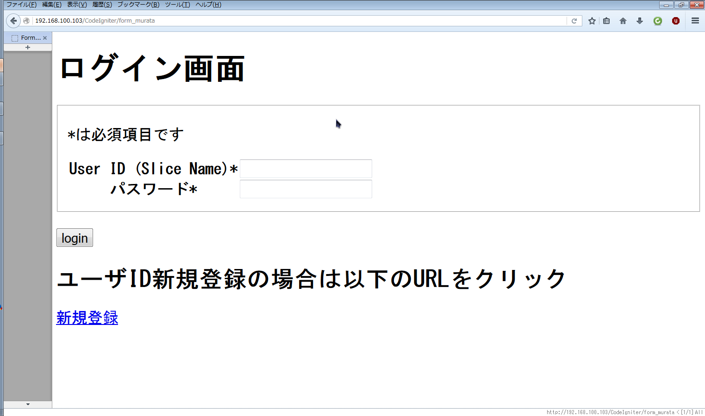
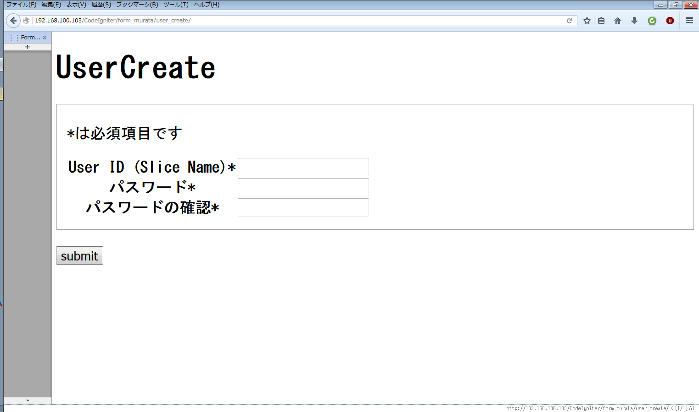
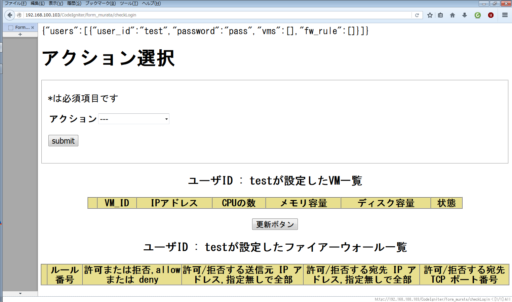
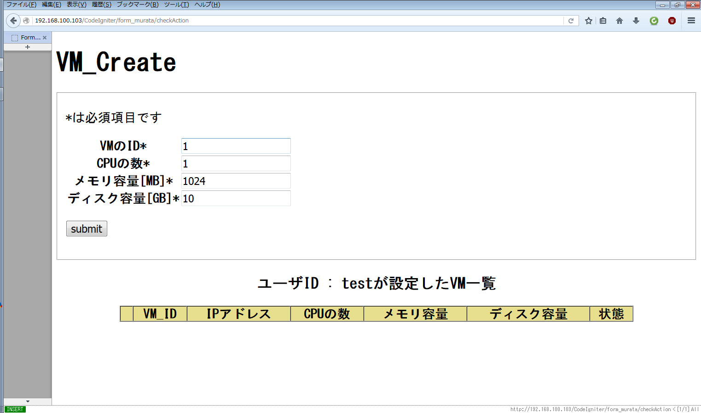
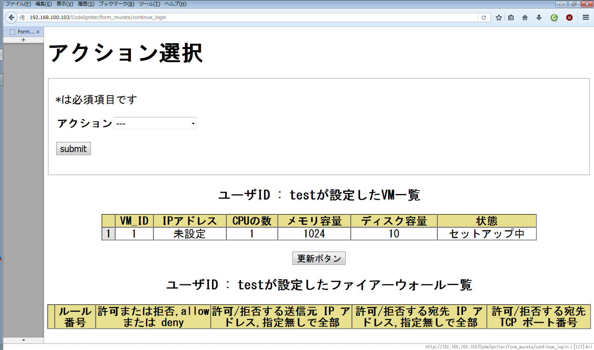
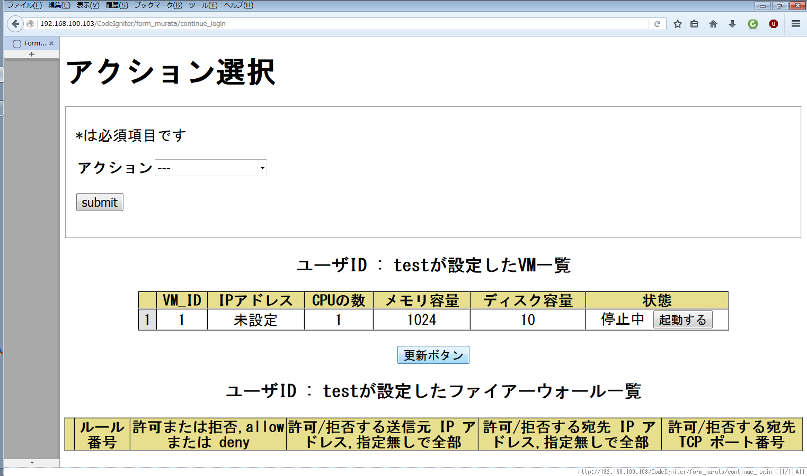

# 不正アクセス検知機能を持つ仮想FWを備えたIaaS

## 概要
Virtualbox と OpenFlow を用いて FW（ファイアウォール）機能を備えた MiniIaaS
を作成しました。ユーザ（クラウド利用者）は Web インターフェースにより
仮想マシン（VM）を作成・編集・削除・起動・停止することができ、さらにユーザ単位で希望する
FW のルールを設定できます。

また、（クラウド側のネットワークと）この FW 機能は
OpenFlow（Trema）によって実現されており、
不正なアクセス（ICMP Flood）を自動検知し遮断する機能も備えています。
これにより、遮断されるべき不正アクセス元の情報（Blacklist）は全てのユーザの通信ルールに反映され、
IaaS上に作成された全てのVMをセキュリティ脅威から守ります。


## 紹介用ポスター
[ポスターはこちら](./img/enshu_poster_final.pdf)

## 成果物の説明
* 基本的に全て Controller のソースコード
    * Controller および VM の操作に関するモジュールは主に /lib/ に配置
* /CodeIgniter.zip
    * Web コンテンツ。解凍して Web サーバの DocumentRoot に配置して使用

## デモ（使い方）

### デモの内容
ユーザが VM を作成し、起動するまでの設定・操作方法を記します。

### Controller の設定
1. 〜〜から VM イメージをダウンロード。Virtualbox で起動。
1. ID:ensyuu2 / Password:ensyuu2 でログイン。
1. Controller に IP アドレスを設定
  * Web サーバ/DHCP サーバ 用に NIC を一つ用意
  * そのインターフェース（eth0） に静的 IP アドレスを設定
1. 以下のコマンドを実行して DHCP サーバを起動
```
$ sudo service isc-dhcp-server start
```
1. ~/git/iaas/ に移動し、以下のコマンドを実行して Controller を起動
```
$ ruby ./test.rb
```

### PM (Physical Machine) の設定
（PMの設定をかく）


### 使用例

1. ユーザの PC から Web ブラウザで Controller にアクセス
```
 http://(ControllerのIPアドレス)/CodeIgniter/form_murata
```
2. 「新規登録」をクリックし、ユーザ作成画面でユーザを作成してログイン

 
 

3. 「アクション」から「VM_CREATE」を選択

 

4. VM の情報を入力し、VM を作成（作成には時間がかかります）

  
  

5. VM の状態が「停止中」になった後、「起動する」ボタンを押下

 

6. VM が起動すると管理画面にて IP アドレスが表示されるので ssh でアクセス
    * ID: root / Password: password
